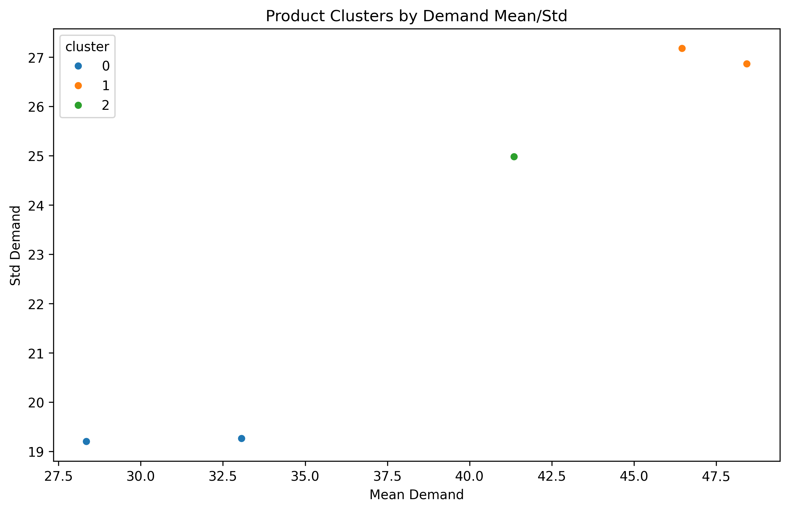
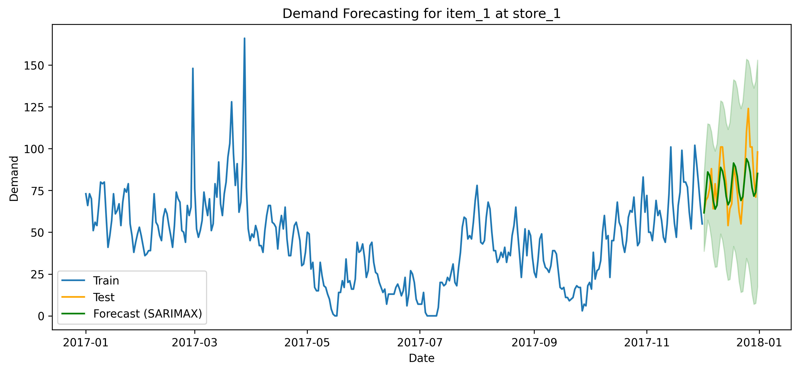
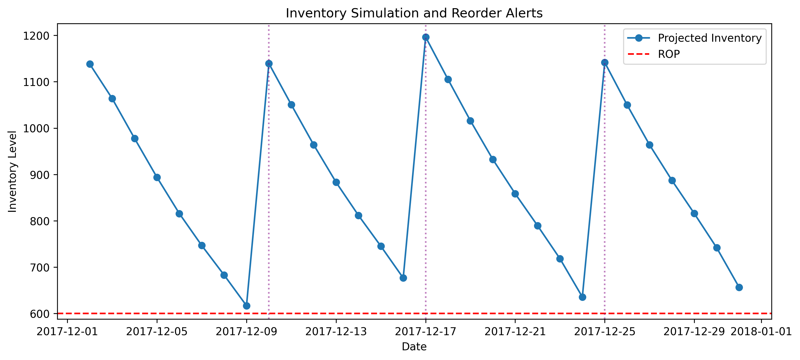
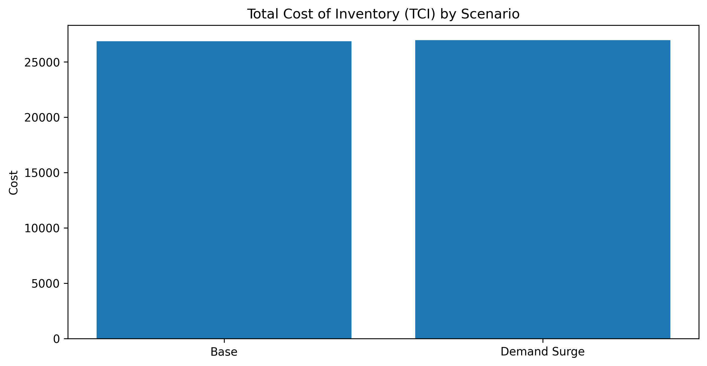
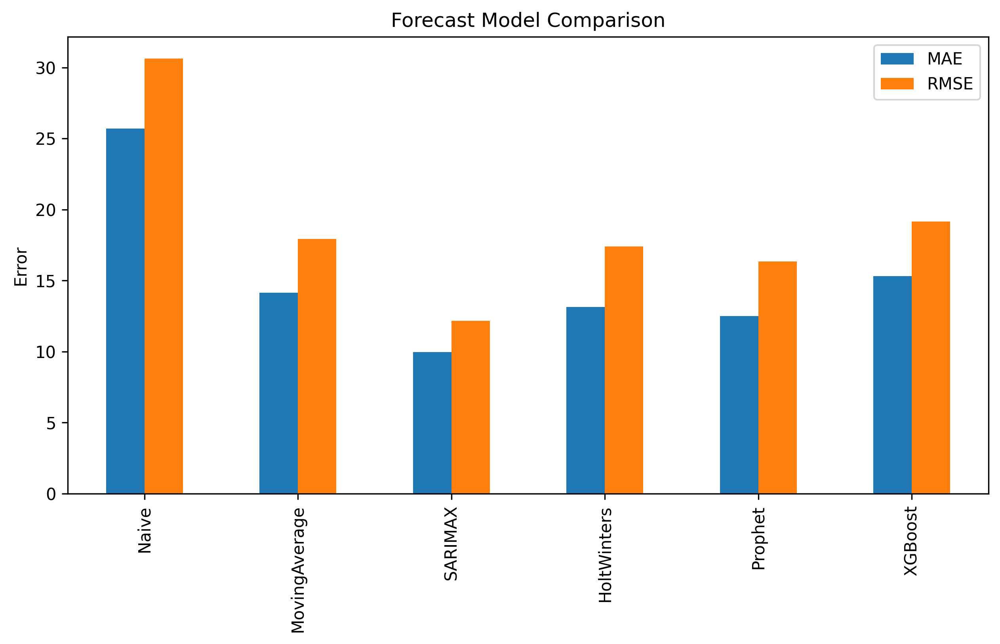

# Supply Chain Inventory Optimization Project

## Problem Summary
This project demonstrates a complete data analyst workflow for supply chain inventory optimization using synthetic data modeled after the M5 Forecasting dataset. The goal is to simulate realistic sales data, forecast demand, and optimize inventory levels to minimize stockouts and excess inventory.

## Project Structure

```
supply_chain_inventory_optimization/
│
├── data_generation.py           # Synthetic data creation and transformation
├── forecasting.py               # Demand forecasting and model comparison
├── inventory_optimization.py    # Inventory logic, reorder point, simulation, and KPIs
├── visualization.py             # All plotting functions
├── main.py                      # Main script to run the full workflow
├── app.py                       # Streamlit dashboard for interactive analysis
├── requirements.txt             # Python dependencies
├── README.md                    # Project documentation
```

## Key Features and Visualizations

### 1. Demand Forecasting
- **Model Comparison Plot:** Bar chart comparing MAE and RMSE across different forecasting models
  - Includes Naive, Moving Average, SARIMAX, Holt-Winters, Prophet, and XGBoost
  - Visual comparison of model performance metrics
- **Forecast Visualization:** Time series plot showing
  - Historical demand (training data)
  - Actual demand (test data)
  - Predicted demand with confidence intervals
  - Clear visualization of forecast accuracy

### 2. Inventory Simulation
- **Inventory Level Plot:** Time series visualization showing
  - Projected inventory levels
  - Reorder Point (ROP) line
  - Reorder alerts
  - Stockout events
- **Cost Analysis:** Bar chart comparing
  - Base scenario costs
  - Scenario testing costs (delay, demand surge)
  - Total Cost of Inventory (TCI) breakdown

### 3. Product Segmentation
- **Volatility Classification:** Table showing product volatility categories
  - Stable vs. volatile products
  - Risk assessment
- **Cluster Analysis:** Scatter plot showing
  - Product clusters based on demand patterns
  - Mean vs. Standard Deviation of demand
  - Color-coded clusters for easy interpretation

## Plots & Results

### 1. Product Clusters by Demand Mean/Std
This scatter plot shows the clustering of products based on their mean demand and standard deviation using a clustering algorithm (e.g., K-Means).

- **Cluster 0:** Products with low mean and low variability (stable demand)
- **Cluster 1:** Products with high mean and high variability (likely high-volume but volatile items)
- **Cluster 2:** Intermediate behavior

This clustering helps identify appropriate inventory strategies based on product demand patterns.

### 2. Total Cost of Inventory (TCI) by Scenario
This bar chart compares the Total Cost of Inventory across two different demand scenarios:

- **Base Scenario**
- **Demand Surge Scenario**

Despite the increase in demand, the total cost remains nearly unchanged, indicating that the inventory policy is robust and cost-effective under variable conditions.

### 3. Demand Forecasting for Item_1 at Store_1
This line plot demonstrates a demand forecast using the SARIMAX model:

- **Blue:** Training data
- **Orange:** Actual test values
- **Green:** Forecasted demand with confidence intervals

The forecast closely follows the actual trend, demonstrating strong predictive accuracy and capturing both seasonality and fluctuations.

### 4. Inventory Simulation and Reorder Alerts
This simulation illustrates projected inventory levels over time:

- **Blue line:** Projected inventory depletion
- **Red dashed line:** Reorder point (ROP)
- **Purple vertical lines:** Reorder events triggered

The system successfully triggers reorders just before hitting the ROP, validating the inventory replenishment logic.

### 5. Forecast Model Comparison
A bar chart comparing the accuracy of different forecasting models using MAE (Mean Absolute Error) and RMSE (Root Mean Squared Error):

- **SARIMAX** performs best with the lowest error rates
- **Prophet** and **Holt-Winters** also perform well
- **Naive** and **Moving Average** have the highest error, highlighting their limitations for complex demand patterns

This evaluation supports the choice of advanced models for reliable demand forecasting.

## Assumptions for Data Generation
- 5 unique products (`item_id`) across 2 stores (`store_id`) for better performance
- Each product belongs to one of 4 categories (`category_id`)
- Daily demand is simulated for 1 year (365 days)
- Demand patterns include:
  - Weekly seasonality
  - Random noise
  - Occasional spikes
  - Price effects
  - Weather impacts
  - Holiday effects
  - Promotion boosts

## Inventory KPIs Tracked
- **Reorder Point (ROP):** When to trigger a new order
- **Service Level:** Percentage of days with no stockouts
- **Stockout Risk:** Number of days with zero inventory
- **Forecast Accuracy:** MAE and RMSE for demand prediction
- **Total Cost of Inventory (TCI):** Combined holding, stockout, and order costs

## How to Run

1. **Install requirements:**
   ```bash
   pip install -r requirements.txt
   ```

2. **Run the main script:**
   ```bash
   python -m supply_chain_inventory_optimization
   ```

3. **Run the Streamlit dashboard:**
   ```bash
   streamlit run app.py
   ```

4. **Outputs:**
   - `sales_long.csv` — Synthetic sales data in long format
   - `calendar.csv` — Calendar with date and weekday info
   - Interactive visualizations in the Streamlit dashboard
   - Model performance metrics
   - Inventory simulation results

## Module Descriptions

### data_generation.py
- Generates synthetic sales data with realistic patterns
- Creates calendar with holidays and promotions
- Joins sales data with calendar information
- Handles data transformations and cleaning

### forecasting.py
- Implements multiple forecasting models:
  - Naive forecasting
  - Moving Average
  - SARIMAX with proper time series handling
  - Holt-Winters
  - Prophet
  - XGBoost with feature engineering
- Model comparison and evaluation
- Proper time series index handling

### inventory_optimization.py
- Calculates optimal reorder points
- Simulates inventory levels
- Handles reorder triggers
- Calculates service levels and costs
- Scenario testing capabilities

### visualization.py
- Interactive plotting functions for Streamlit
- Proper figure management
- Consistent styling and formatting
- Error handling for empty data cases

### app.py
- Interactive Streamlit dashboard
- Real-time parameter adjustment
- Dynamic visualization updates
- Scenario testing interface
- ML insights display

## Implementation Details

### Data Generation
- Synthetic data mimics real-world patterns
- Includes multiple influencing factors
- Handles missing values and outliers
- Proper date handling and time series formatting

### Forecasting
- Multiple model comparison
- Proper time series index handling
- Confidence interval calculation
- Error metric computation


### Inventory Optimization
- Dynamic ROP calculation
- Service level monitoring
- Cost analysis
- Scenario testing capabilities

### Visualization
- Interactive Streamlit plots
- Proper figure management
- Consistent styling
- Error handling

 ## Graphical Representation
 
 
 

 

 

 


 


## Future Enhancements

### 1. Enhanced Data Generation
- More realistic product hierarchies
- Additional external factors
- More complex seasonality patterns

### 2. Advanced Forecasting
- Deep learning models
- Ensemble methods
- Automated model selection

### 3. Extended ML Features
- More sophisticated clustering
- Anomaly detection
- Predictive maintenance

### 4. Dashboard Improvements
- More interactive features
- Additional scenario testing
- Custom reporting

### 5. Cost Optimization
- More detailed cost analysis
- Optimization algorithms
- What-if analysis tools

---

**Author:**  
*Built with Python, Pandas, NumPy, Statsmodels, Matplotlib, Seaborn, and Streamlit.*

**Note:** All visualizations are interactive in the Streamlit dashboard and can be customized through the user interface.
